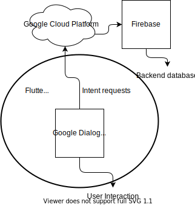

# AmBot: Seu assistente cervejeiro inteligente
## Visão geral

Já pensou em ter um assistente virtual que te ajuda na realização de encomendas para seu bar ou restaurante? O AmBot é a solução ideal que interage por voz para a sua comodidade, e por meio de uma conversa simples e natural, ele oferece uma experiência prática para fechar pedidos. 

O AmBot utiliza a API Google Dialogflow com integração à plataforma Google Cloud, e combina uma interface desenvolvida em Flutter e hospedagem no Firebase. 

[Link da apresentação do projeto.](https://www.canva.com/design/DAEuIZvcNqs/-w-ZE0VRZmOe8zEXUHIosg/view?www.canva.com/design/DAEuIZvcNqs/-w-ZE0VRZmOe8zEXUHIosg/view?utm_content=DAEuIZvcNqs&utm_campaign=designshare&utm_medium=link&utm_source=sharebutton)

_Este é o repositório oficial do AmBot, você pode encontrar as orientações para executá-lo no seu computador pessoal logo abaixo._ 

## Informações técnicas
### Gráfico explicativo

### Pré-requisitos
* Linux
* Dart
* Android Studio
* Flutter
* Celular Adroid (para testar com o .apk)
### Instruções de instalação e execução
Para executar o app basta utilizar o comando <flutter run --no-sound-null-safety> no terminal no diretório do projeto. Caso seja executado utilizando o emulador do Android Studio, é necessário ativar o microfone do emulador para utilizar os recursos de interação por voz. 
Também é possível testar o app instalando o .apk (anexado no projeto do Taikai).
Uma vez com o app instalado e aberto, para realizar a autenticação do usuário e liberar o acesso o usuário deve inserir a senha "senha". 
## Equipe
* Alexandre Vitor Silva Braga [(GitHub)](https://github.com/alexandre-braga)

* Antônio José de Medeiros Filho [(GitHub)](https://github.com/antoniomedeiros1)

* Caio Cedrola Rocha [(GitHub)](https://github.com/caiocrocha)